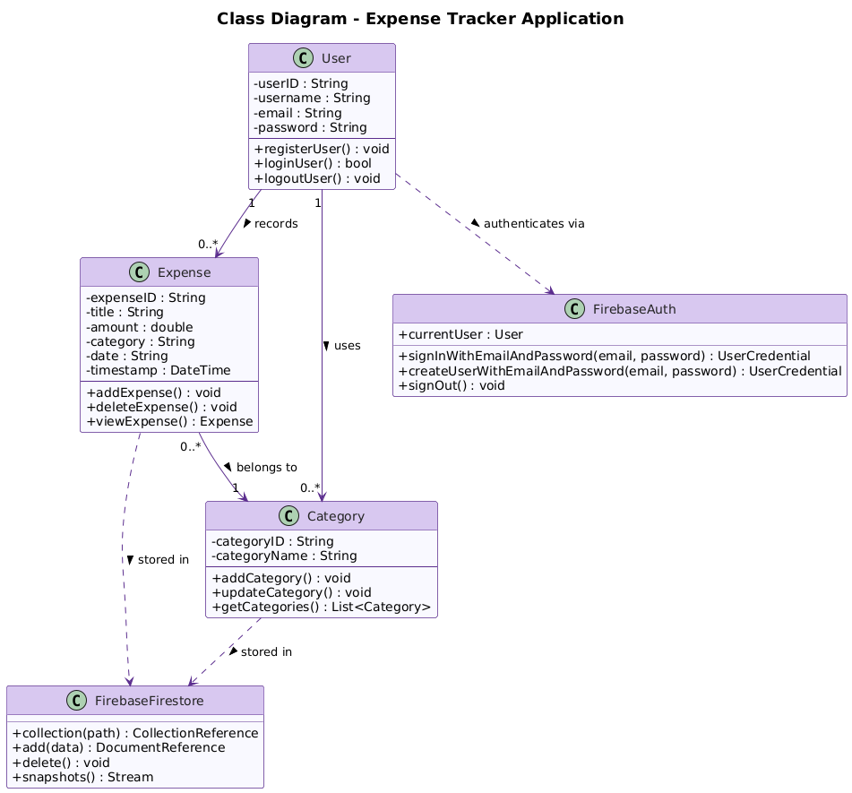
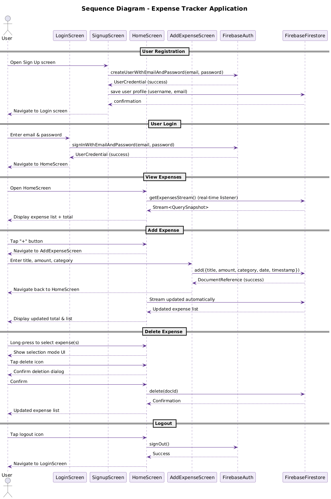
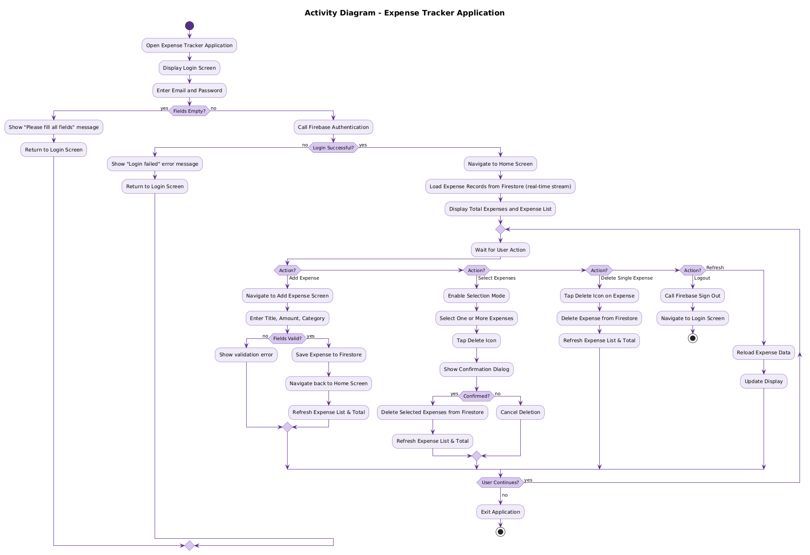
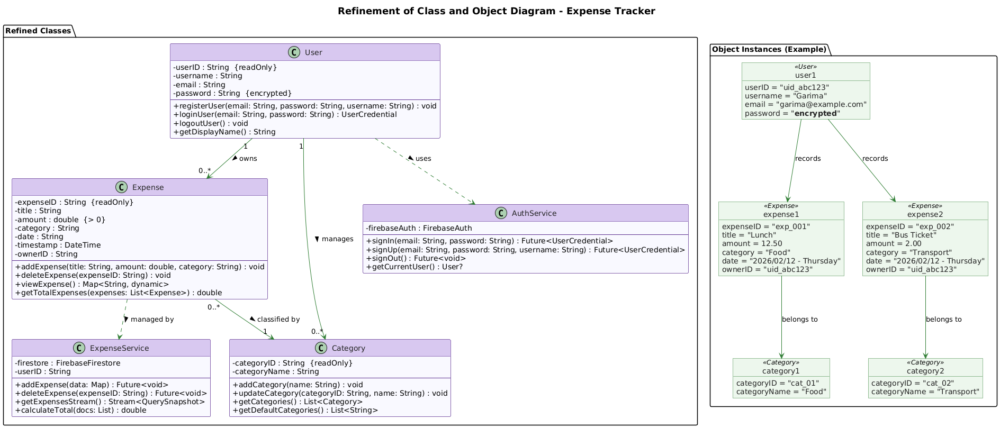
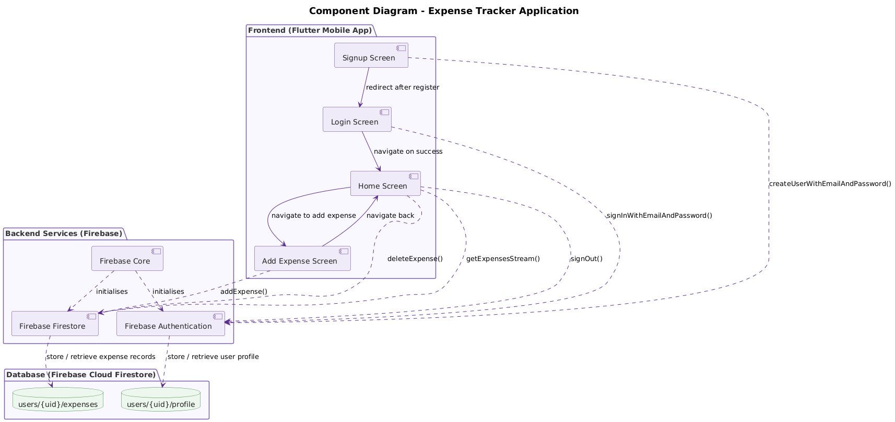
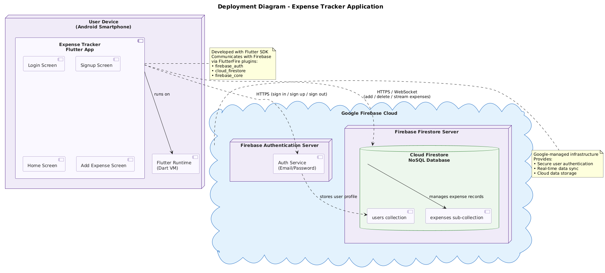

# UML Diagrams – Expense Tracker Application

This directory contains all UML diagrams for the **Expense Tracker Application** (Flutter + Firebase), generated from the project's system analysis and design report.

---

## 1. Class Diagram

Represents the static structure of the system: classes (`User`, `Expense`, `Category`, `FirebaseAuth`, `FirebaseFirestore`), their attributes, methods, and relationships.



**Source:** [class_diagram.puml](class_diagram.puml)

---

## 2. Sequence Diagram

Illustrates the dynamic interaction between the User, UI screens, and Firebase services for the main use cases: **Registration**, **Login**, **View Expenses**, **Add Expense**, **Delete Expense**, and **Logout**.



**Source:** [sequence_diagram.puml](sequence_diagram.puml)

---

## 3. Activity Diagram

Shows the complete workflow (process model) of the application from launch to exit, including decision points for login validation, adding expenses, deleting expenses, and logout.



**Source:** [activity_diagram.puml](activity_diagram.puml)

---

## 4. Refinement of Class and Object Diagram

Presents the **refined class definitions** (detailed attributes with constraints, full method signatures) alongside **object instance examples** showing sample data for `User`, `Expense`, and `Category` objects.



**Source:** [refinement_class_object_diagram.puml](refinement_class_object_diagram.puml)

---

## 5. Component Diagram

Depicts the high-level architecture of the system by showing the three major components — **Frontend (Flutter)**, **Backend Services (Firebase)**, and **Database (Cloud Firestore)** — and their interactions.



**Source:** [component_diagram.puml](component_diagram.puml)

---

## 6. Deployment Diagram

Describes the physical deployment topology: how the Flutter mobile application installed on an **Android smartphone** communicates over HTTPS/WebSocket with **Google Firebase Cloud** (Authentication Server + Firestore Server).



**Source:** [deployment_diagram.puml](deployment_diagram.puml)

---

## Regenerating Images

The PNG images are generated from the `.puml` source files using [PlantUML](https://plantuml.com/). To regenerate them, run:

```bash
# Requires Java and Graphviz (apt install graphviz)
java -jar plantuml.jar -tpng docs/diagrams/*.puml
```
